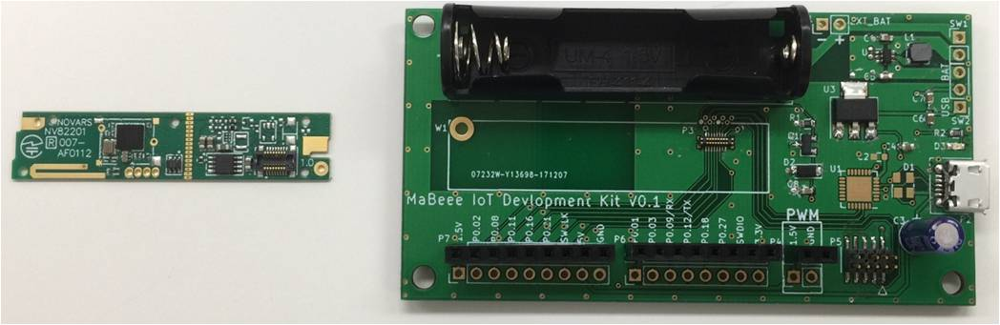
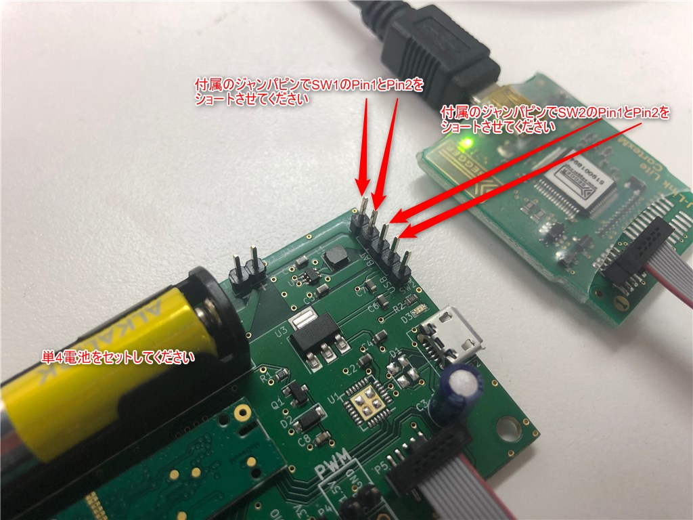
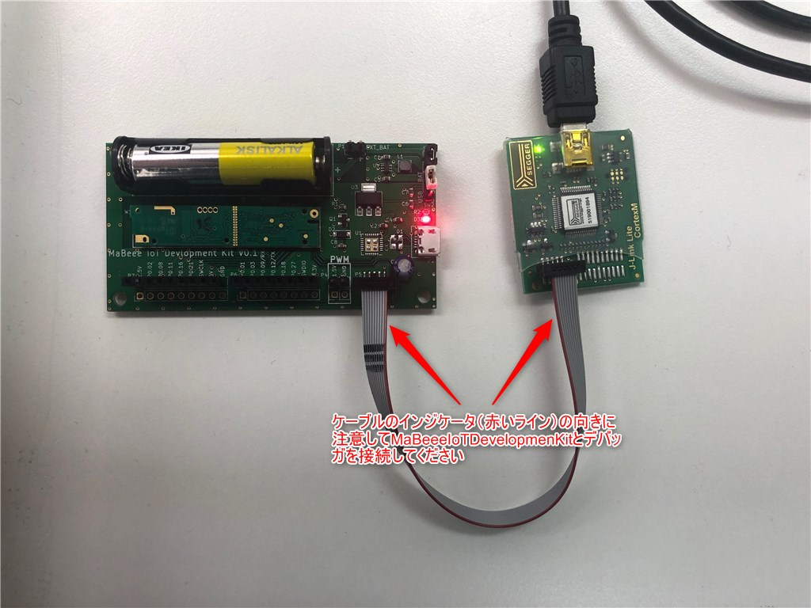
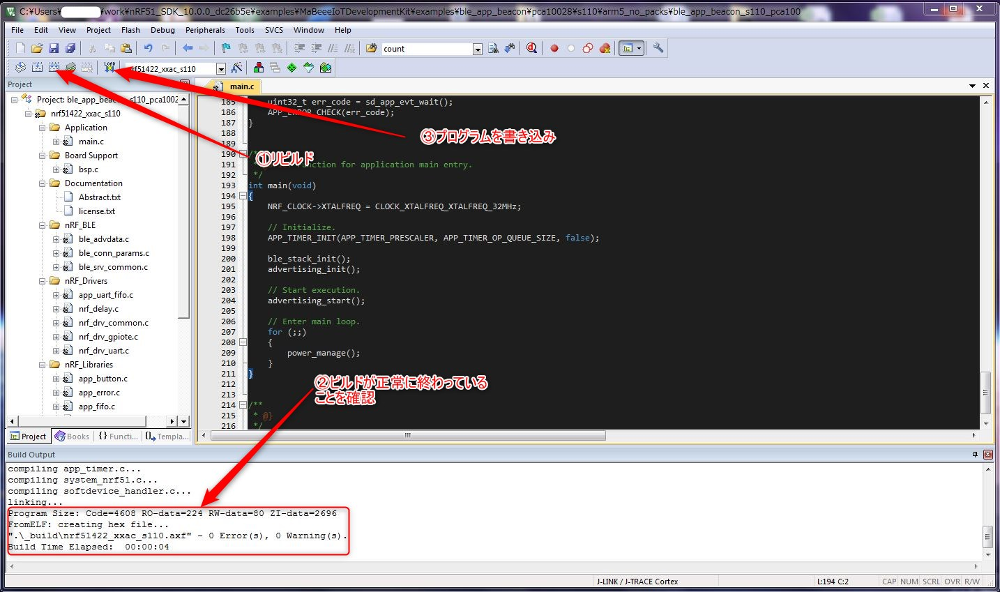
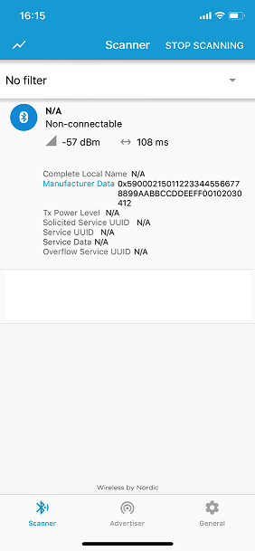

# MaBeee IoT Development Kit

## 概要

### MaBeee IoT Development Kitとは

- スマホと繋がる乾電池「MaBeee」
- MaBeee(マビー)はおもちゃやライトなど、単3の乾電池で 動く製品をスマホ専用のアプリでコントロールできるようになる乾電池型IoT製品です。
- MaBeee IoT Development KitとはMaBeeeで培った小型モジュール技術を元にしたIoTデバイスの開発キットです
- MaBeeeをベースにした通信基板，開発用のベース基板の2枚で構成されており通信基板は技適取得済です．本開発キットで開発を行ったあとは量産品への組み込みも可能です．

## 技術情報

|仕様||
|:---|:---|
| 通信基板型番 | MB-3102 |
| ベース基板型番 | DV-4001 |
| 通信方式 | Bluetooth Low Energy 4.2 |
| 認証 | Bluetooth認証/技術適合認定 |
| SoC | Nordic Semiconductor nRF51822 |
| CPU | Cortex-M0 32MHz |
| RAM | 16KB |
| Flash | 256KB |
| 動作温度範囲| 0℃~40℃ |
| ペリフェラル | GPIO x 11(うち，3本はEEPROMが使用) / 10bit ADC / UART / SPI接続EEPROM16kBit搭載 |
| 開発環境 | nRF5-SDK V10 / Softdevice S110 / MDK-ARM |
| その他| 単４電池１本でスタンドアロン動作可能 |

## 技術資料

MaBeeeIoTDevelopmentKitはNordic Semiconductor社製nRF51822を搭載しています.nRF51 SoCの資料およびツール郡は以下に公開されています．

- [nRF51822公式ページ](https://www.nordicsemi.com/eng/Products/Bluetooth-low-energy/nRF51822)
- [nRF5 SDK](https://www.nordicsemi.com/eng/Products/Bluetooth-low-energy/nRF5-SDK)[(バージョン10を推奨)](https://developer.nordicsemi.com/nRF5_SDK/nRF51_SDK_v10.x.x/)
- [Nordic devzone](https://devzone.nordicsemi.com)
- [nRF Go Studio](https://www.nordicsemi.com/eng/Products/2.4GHz-RF/nRFgo-Studio)
- nRF Connect for [iOS](https://itunes.apple.com/jp/app/nrf-connect/id1054362403) / [Android](https://play.google.com/store/apps/details?id=no.nordicsemi.android.mcp&hl=ja)
- [MDK-ARM](http://www2.keil.com/mdk5/)

## スタートガイド

1. MaBeeeIoTDevelopmentKitとデバッガとPCを接続

1. MDK-ARMをインストール(バージョン5以上を推奨)

1. nRF5_SDKをダウンロード(バージョン10を推奨．最新版はnRF5_SDK_10.0.0_dc26b5eです)

1. 本レポジトリをnRF5_SDK_10.0.00_xxxxxxx/exampleフォルダ内にclone

1.  nRF5_SDK_10.0.00_xxxxxxx/examples/MaBeeeIoTDevelomentKit/examles/ble_app_beacon/pca10028/s110/ble_app_beacon_s100_pca10028.uvprojxをダブルクリック

1. MaBeeeIoTDevelopmentKitに書き込み(MDK-ARMが新規インストールの場合SoftPackのインストールを求められる場合があります)

1. nRF Connectを起動すると以下のような画面が見えるはずです．

## ピン配置

工事中

## サンプルプログラム

本レポジトリのexampleフォルダ内にサンプルプログラムがあります．

- ble_app_beacon ビーコンのサンプル

## ベース基板回路図

工事中
